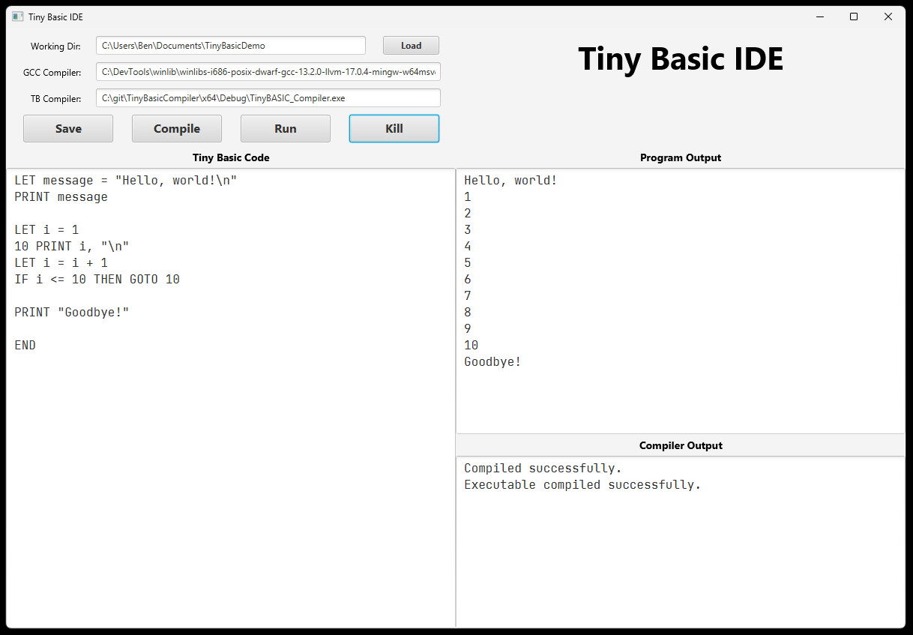

# Tiny Basic IDE

The Tiny Basic IDE offers a streamlined scripting experience for writing Tiny Basic code. It is to be used in conjunction with the [Tiny Basic Compiler](https://github.com/Benlewis9000/TinyBasicCompiler).

## Build steps

1. JDK 14 is required to build and run this project.
2. Clone the repository to your machine.
3. Ensure you have [Apache Maven](src/main/resources) installed and setup correctly. This project was tested against version 3.9.2.
4. Navigate to the repository root and in the command line enter `mvn package`.
5. The built jar should now be visible in the `/target` directory.

## Usage

1. Launch the app by double clicking the built executable or via the command line e.g. `java -jar TinyBasicIde-1.0-SNAPSHOT.jar`
2. Set the path for your...
   - working directory e.g. `C:\Users\ben\tinybasic`. This is where `.tb` source and utility files will be loaded and saved.
   - desired gcc exe.
   - basic compiler exe.
3. Add your tiny basic script to the editor.
4. Save the workspace.
5. Compile your script. See the compiler output feed for info.
6. Run the compiled executable. See the output in the program output feed.
7. Kill the program as desired if it does not stop running itself.

